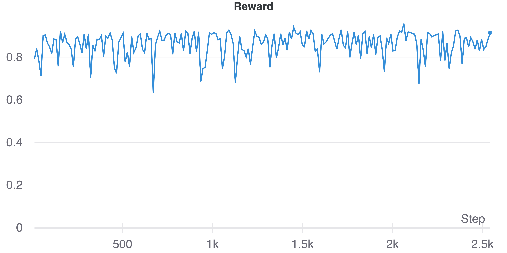
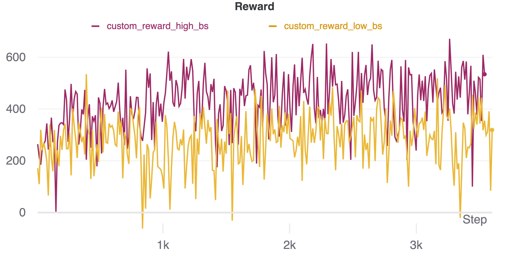
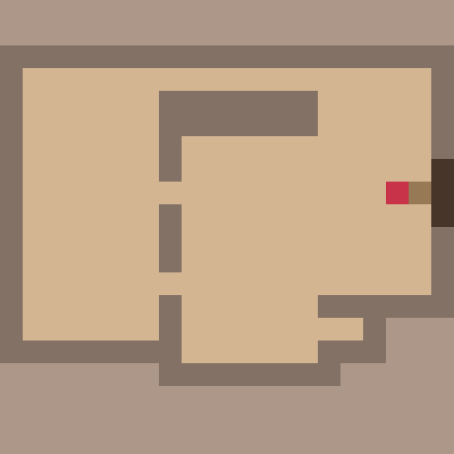

# Домашнее задание 

## Описание подхода
В качестве алгоритма для обучения был взят алгоритм PPO, код для которого представлен [здесь](/models/ppo.py)

Архитектура модели для актора и критика выглядит следующим образом:
```
Conv2d(4, 16, kernel=(3, 3), stride=2)
ReLU
Conv2d(16, 32, kernel=(3, 3), stride=2)
ReLU
Conv2d(32, 1, kernel=(3, 3), stride=1)
ReLU
Linear layers
```

В качестве функции награды была использована дефолтная награда из среды:
- `reward = ratio_new_explored`

а также кастомная награда: 

- `reward = 0.1 + ratio_total_explored * 20`, если были исследованы новые клетки
- `reward = -0.5`, если клетка уже была исследована
- `reward = -1`, если агент стоял на месте

С обоими видами наград были проведены эксперименты

## Обучение
Дефолтный конфиг лежит в `configs/config.yaml`, в нем доступны основные гиперпараметры обучения, архитектуры модели и среды. 

Запуск обучения производится следующим образом:
```
python3 train.py --config <PATH_TO_CONFIG> --name <EXPERIMENT_NAME>
```
В результате будет создана директория `checkpoints/<EXPERIMENT_NAME>`, куда будут сохраняться чекпоинты модели. Эти же чекпоинты будут логироваться в соответствующий проект wandb

## Логирование
Логирование результатов экспериментов производилось в проект [wandb](https://wandb.ai/daevsikova/prod_hw5_rl?workspace=user-daevsikova)

В каждом эксперименте доступны:
- чекпоинты модели
- конфиг
- графики лоссов, энтропии и награды
- траектории агента

## Результаты
- Оценка средней награды в 5 случайных эпизодах и рендеринг траекторий производился для максимум 400 шагов агента
- Траектории представлены для 2000-й итерации обучения агента

### 1. Эксперимент с дефолтной наградой

[Ссылка на эксперимент](https://wandb.ai/daevsikova/prod_hw5_rl/runs/384exo2r?workspace=user-daevsikova)




Если агент за эпизод исследовал все клетки, то суммарная награда составит 1. Как видно из графика, средняя награда превышает 0.8. Однако агент склонен застревать, как видно в примере траектории, так как остановки при таком типе награды никак не штрафуются. Но в целом, агент с данным типом награды обучается довольно неплохо.

### 2. Пара экспериментов с кастомной наградой




[Ссылка на эксперимент 1](https://wandb.ai/daevsikova/prod_hw5_rl/runs/3tb9pc0m?workspace=user-daevsikova)

В данном эксперименте был увеличен размер буффера до 2000 и размер батча для обновления агента до 30. 


[Ссылка на эксперимент 2](https://wandb.ai/daevsikova/prod_hw5_rl/runs/3hycu2wf?workspace=user-daevsikova)

В данном эксперименте был уменьшен размер буффера до 1000 и размер батча для обновления агента до 10. 



Как видно из графиков средней награды, увеличение размера буффера и размера батча привело к увеличению средней награды. Награда в этом эксперименте со временем обучения возрастает. По траекториям так же видно, что за 400 шагов агент в первом эксперименте успевает исследовать практически все клетки. 

- В качестве последующих экспериментов можно рассмотреть другие алгоритмы для обучения, например, DQN.

- Попробовать определить другие функции награды